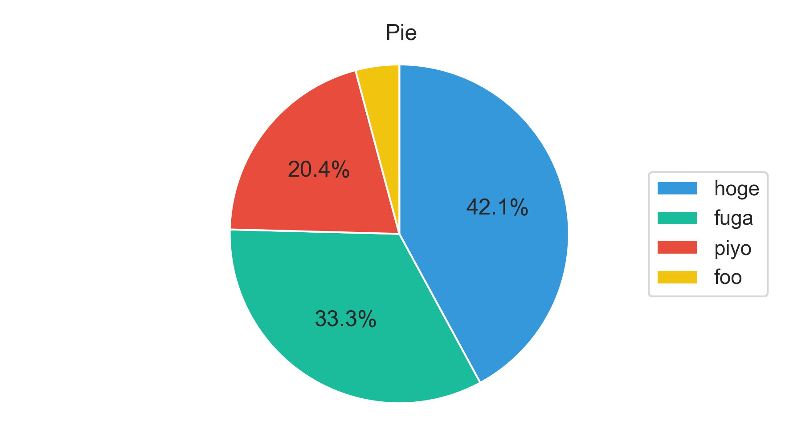

# matplotlib templates

## Overview
This is a repository gathering samples using matplotlib.

## Object-oriented Sample
``` python
import matplotlib.pyplot as plt
import numpy as np

x = np.arange(-3, 3, 0.01)
y_sin = np.sin(x)
y_cos = np.cos(x)

# Figure instance
fig = plt.figure()

# Axes instance
# add_subplot: nrows, ncols, index
# add_subplot(2, 2, 1)
# add_subplot(2, 2, 4)
# 1 2
# 3 4
ax1 = fig.add_subplot(2, 1, 1)
ax2 = fig.add_subplot(2, 1, 2)

# Plot graph
ax1.plot(x, y_sin, label="label 1")
ax2.plot(x, y_cos, label="label 2")

# Set graph style
ax1.set_title("sin x")
ax2.set_title("cos x")

ax1.set_xlabel("x")
ax2.set_xlabel("x")
ax1.set_ylabel("sin x")
ax2.set_ylabel("cos x")

ax1.legend(bbox_to_anchor=(1.05, 1), loc='upper left', borderaxespad=0, framealpha=0)
ax2.legend(loc="upper right")

# Adjust margin
fig.tight_layout()


plt.show()
```

## Templates
- `bar/bar_bar.py`


- `pie/pie_ratio.py`


## Reference
[FAQ](https://matplotlib.org/faq/howto_faq.html)
